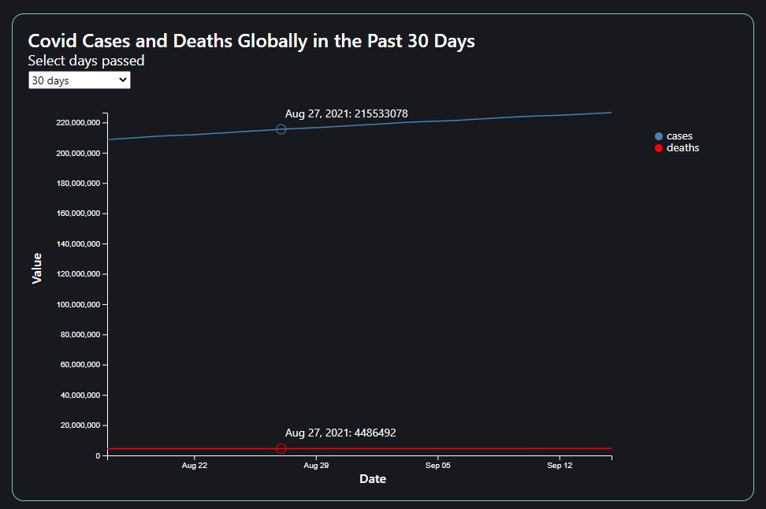
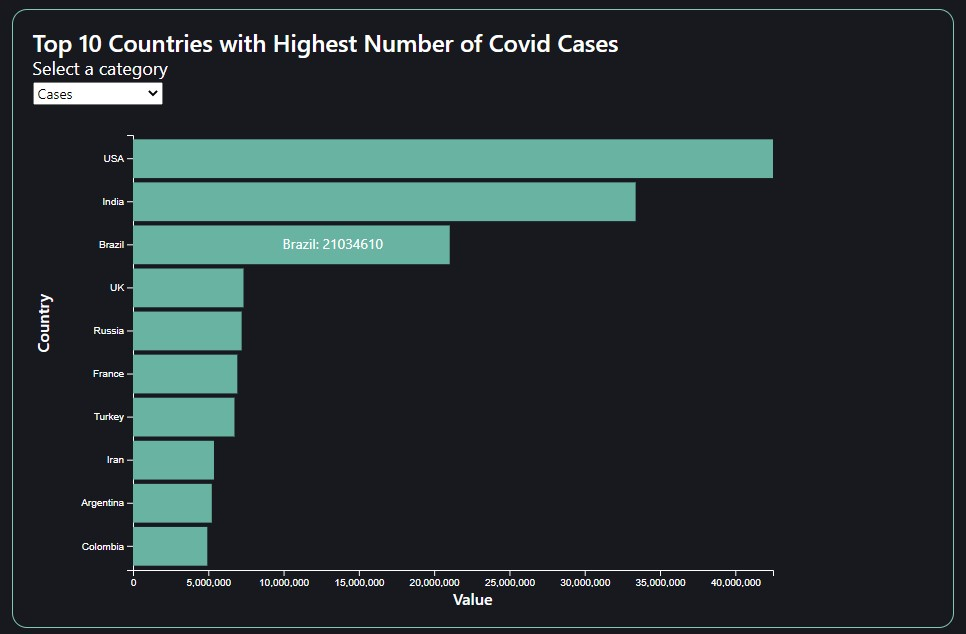

# Background and Overview
Corantine is a data visualization of the COVID pandemic. The app renders a line chart detailing the number of COVID cases and deaths globally over a certain period of time and a bar chart detailing the top ten countries with the highest totals in a certain category.

# Functionality and MVPs
Users will be able to:
- select a time period (e.g. past 30 days, past 365 days)
- select a category (e.g. cases, deaths, recovered)
- hover over visualizations to see actual data
- view different data visualizations

# Architecture and Technology
- Javascript
- D3
- disease.sh API
- HTML
- CSS

# Bonus Features
- display a global map of COVID cases
- display a bar chart race on COVID cases and deaths